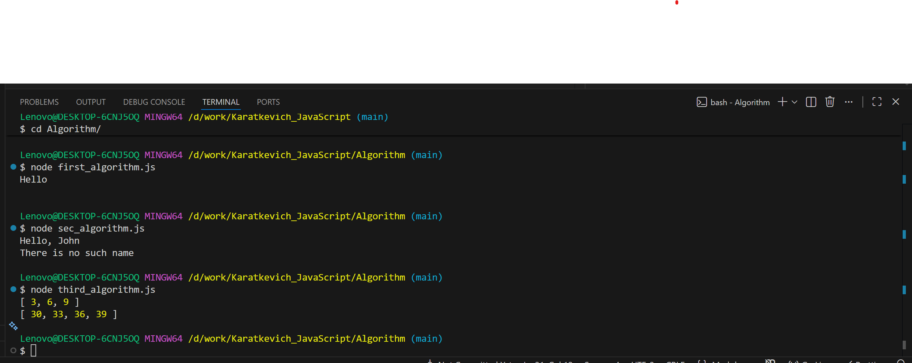
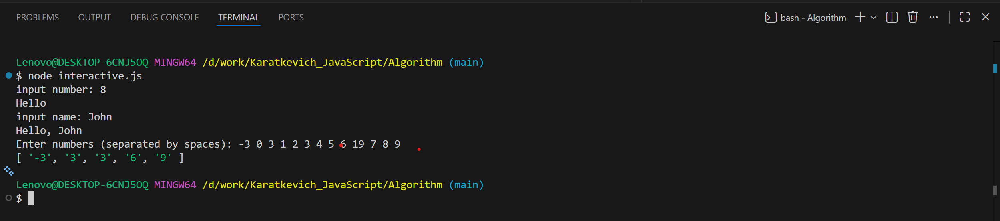
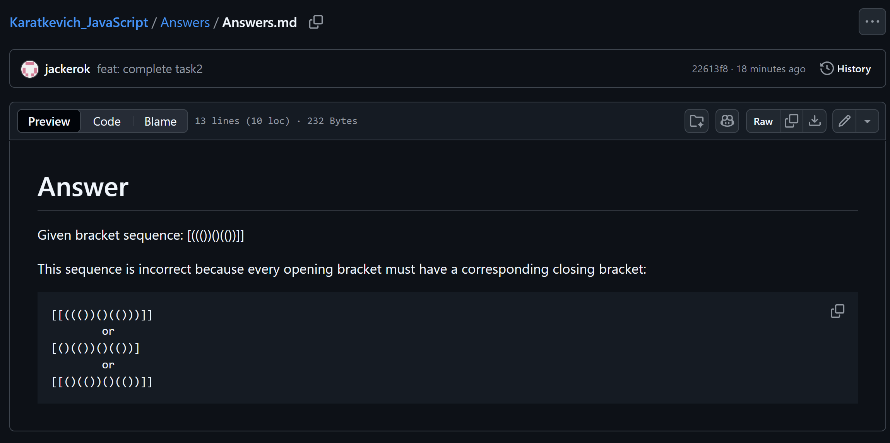

# Test Task

1. Clone repository

## First task

1. Open folder "Algorithm"
2. Need to have **Node.js** installed to run it.
3. In the CL (terminal), run the command:

- node first_algorithm
- node sec_algorithm
- node third_algorithm
- node interactive

## Second task

1. Open folder "Answers"
2. And read **Answers.md**

## Results

**Results of 1-3 tasks**   
**Results of all Alg**   
**Task 2** 
